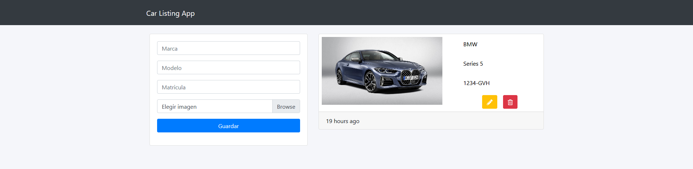

# Javascript Webpack MongoDB

This project was generated with NodeJS. To test it, please set the `MONGODB_URI` environment variable into `configs/.env` file and make sure to put the absolute url of the development server in the `book service` file and in the `src` attribute of the img tag that is inside the `UI` class.

A simple car listing webapp with CRUD.

## Development server

Run `npm run dev` for a dev backend server. Navigate to `http://localhost:3000/`. Run `npm run serve` for a dev frontend server with webpack. Navigate to `http://localhost:8080/` The app will automatically reload if you change any of the source files.